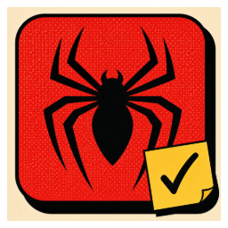
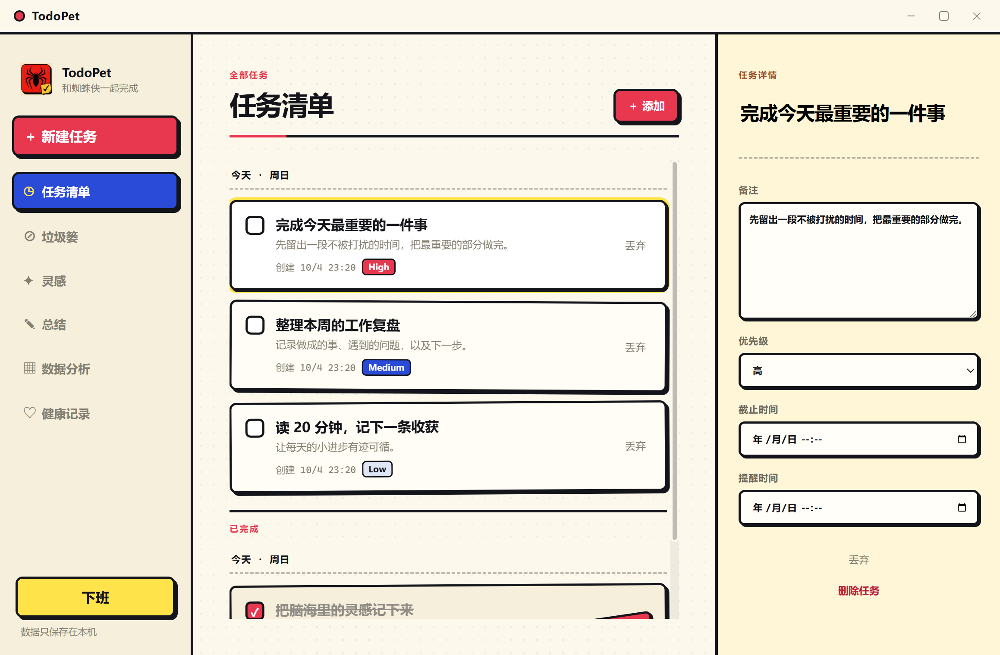
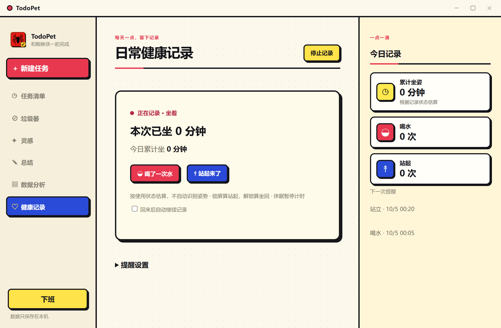

<p align="center">
  
</p>

<h1 align="center">TodoPet</h1>

<p align="center"><strong>把待办留在手边，让桌宠提醒你喝水、站起来。</strong></p>
<p align="center">Windows 桌面应用 · 本地保存 · 像素桌宠</p>
<p align="center">
  <a href="https://github.com/Dvsx/TodoPet/releases/latest">下载 Windows 版</a> ·
  <a href="#开始使用">开始使用</a> ·
  <a href="#本地开发">本地开发</a> ·
  <a href="LICENSE">MIT 源码许可</a>
</p>



TodoPet 把任务清单、灵感笔记和喝水／站立提醒放在一个本地应用里。主窗口用来整理事情，倒挂在桌面上的像素蜘蛛侠负责给出轻量反馈：记下任务、完成任务，或者提醒你从屏幕前休息一下。

截图来自应用的独立演示数据，不包含个人任务或真实健康记录。

## 一天里怎么用

| 你正在做的事 | TodoPet 能帮什么 |
| --- | --- |
| 开始工作 | 写下待办，设置优先级、截止时间和提醒时间。 |
| 工作中想到一个点子 | 放进「灵感」，不用挤进任务列表。 |
| 在电脑前坐久了 | 桌宠提示喝水、站起来；你确认后留下记录。 |
| 暂时离开电脑 | 息屏、休眠时暂停记录与提醒，回来后不补播过期提醒。 |
| 结束一天 | 写下「总结」，在数据分析中回看任务和坐站记录。 |



### 小小桌宠，独立于主窗口

<p align="center"></p>

- 可以拖动位置，也可以从托盘隐藏或重新显示。
- 任务完成时给出反馈，健康提醒时播放下落动画和提示。
- 关闭主窗口后仍留在托盘；需要完全退出时，使用托盘的退出操作。

## 开始使用

前往 [Releases](https://github.com/Dvsx/TodoPet/releases/latest)，选择同一版本中的一个文件：

| 文件 | 适合谁 |
| --- | --- |
| `TodoPet-0.1.0-setup-x64.exe` | 日常使用；通过安装向导选择安装目录。 |
| `TodoPet-0.1.0-portable-x64.exe` | 先体验；直接运行，无需安装。 |

两个文件是同一个 **v0.1.0 正式版本** 的不同分发方式。当前提供 Windows x64 构建，尚未提供 macOS、Linux 或 ARM 安装包。

1. 启动后，在「任务清单」新建第一件事。
2. 在「健康记录」检查当前记录状态，并设置喝水、站立提醒间隔。
3. 把桌宠拖到顺手的位置；主窗口关闭后，可从系统托盘重新打开。

升级时，先从托盘退出旧版，再运行新版。便携版同样使用系统用户数据目录，并不会把记录保存在 EXE 旁边。

## 记录与提醒的规则

- **锁屏**视为站起来，解锁后回到坐姿；锁屏期间不发送健康提醒。
- **息屏／休眠**暂停记录和健康提醒；单独亮屏不代表你已回来，检测到操作后才按自动恢复设置继续。
- **手动暂停或关闭自动恢复**会被保留，不会因为亮屏而强行重新开始。
- 返回后重新安排健康提醒周期；已经过期的喝水、站立提醒和动画不会排队补播。
- 坐站时长来自应用状态和你的确认，**不是人体姿势检测**。

## 数据保存在自己电脑上

无需登录，也不需要配置 API Key。任务、笔记和健康记录使用本地 SQLite 保存；当前没有账号体系或云同步。

Windows 默认数据目录：

```text
%APPDATA%\todopet\
├── todopet.db
├── window-settings.json
└── backups\                # 旧数据迁移时按需创建
```

备份时，先完全退出 TodoPet，再复制整个数据目录。不要在程序运行时只复制单个数据库文件，以免漏掉 SQLite WAL 中的数据。删除安装包或旧构建目录不会删除这个用户数据目录。

## 本地开发

已验证的开发环境：Windows、Node.js 24、pnpm 11。Electron 提供应用运行时；开发者不需要单独安装数据库。

```powershell
git clone https://github.com/Dvsx/TodoPet.git
cd TodoPet
pnpm install --frozen-lockfile
pnpm dev
```

```powershell
pnpm test         # 单元及集成测试
pnpm build        # 类型检查和生产构建
pnpm package      # Windows 安装版与便携版 → release/
```

打包前请退出正在使用 `release/win-unpacked/` 的实例。清理脚本只处理该构建目录，不会强制结束其他 TodoPet 进程。

<details>
<summary>项目结构与桌面交互验证</summary>

```text
src/main/          窗口、任务、健康记录、提醒调度与 SQLite
src/preload/       限定的主进程／页面 IPC 接口
src/renderer/      Vue 界面与桌宠动画
src/shared/        类型、统计、窗口区域和事件队列
resources/         桌宠、图标与 Windows 显示器状态监听
scripts/           打包、演示截图和交互回归
assets/readme/     README 的真实界面截图
release/           唯一正式构建输出目录，不进入 Git
```

技术栈：Electron、Vue 3、TypeScript、Pinia、SQLite、Vite、Vitest、Playwright。

构建后可以使用独立测试数据目录进行交互验收：

```powershell
node scripts/verify-task-completion.cjs --packaged
node scripts/verify-screen-off-reminders.cjs --exe=release/win-unpacked/TodoPet.exe
```

屏幕状态脚本默认模拟事件，不会让你的电脑息屏。`--native-drag` 会操作系统鼠标；`--real-display` 等待真实息屏事件，请仅在明确准备好进行桌面测试时启用。

自动测试不能替代每台设备的长期真实息屏验证。v0.1.0 的已验证范围和限制见 [发布记录](CHANGELOG.md)。

</details>

## 许可与反馈

原创源码和文档采用 [MIT License](LICENSE)。角色美术、应用图标和第三方依赖不在该源码授权范围内，见 [素材与第三方说明](THIRD_PARTY_NOTICES.md)。本项目不是蜘蛛侠角色的官方产品。

遇到问题可提交 [Issue](https://github.com/Dvsx/TodoPet/issues)。描述操作步骤、Windows 版本，以及问题发生在首次启动、隐藏重显还是息屏恢复后；请不要上传个人数据库。
